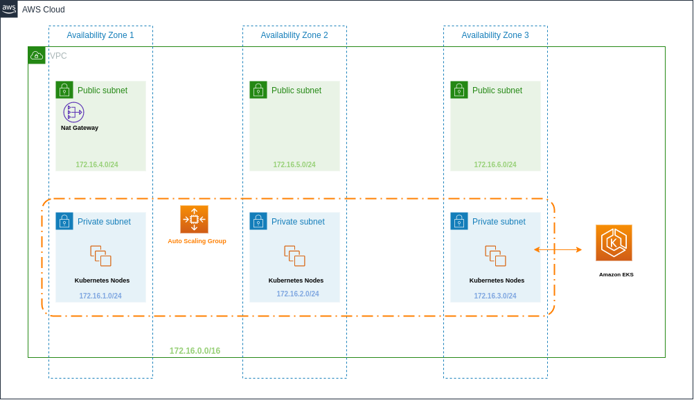

## Elastic Kubernetes Service

Modulo terraform para criar o serviço de Kubernetes gerenciado pelo EKS.

## Requisitos

| Nome | Version |
|------|---------|
| terraform | >= 0.14.0 |
| kubectl | >= 1.11.1 |
| aws-cli-v2 | >= 2.1.1 |

## Arquitetura

## Serviços Instalados no deploy do EKS

| Nome | Version |
|------|---------|
| autoscaler | 1.17.3 |
| alb ingress controller | 1.1.9 |

## Suposições

* Você deseja criar um cluster EKS e um AutoScaling Group para os Node Groups.

* Você quer utilizar como Load Balancer e Ingress Controller o [ALB](https://docs.aws.amazon.com/elasticloadbalancing/latest/application/introduction.html)
 da AWS.

## Importante

Sempre verifique a [versão](https://docs.aws.amazon.com/eks/latest/userguide/kubernetes-versions.html) desejada do EKS 
no site da AWS.

Informe em `aws_profile_name` o profile AWS que provisionará o ambiente.

Opcional: caso queira acessar algum worker node é necessário criar manualmente a sua `Key Pair` e informa-la na variável
corespondente. Não foi criado a funcionalidade de criação automatica com o terraform por questões de [recomendação](https://registry.terraform.io/providers/hashicorp/tls/latest/docs/resources/private_key) da hashicorp e segurança.

## Documentações

* [Security Group Considerations](https://docs.aws.amazon.com/eks/latest/userguide/sec-group-reqs.html)

* [Auto-Scaling](https://docs.aws.amazon.com/eks/latest/userguide/cluster-autoscaler.html)

* [IAM](https://github.com/terraform-aws-modules/terraform-aws-eks/blob/master/docs/iam-permissions.md)

## Outputs

| Nome | Descrição |
|------|-----------|
|cluster_id| Nome do cluster |
|cluster_arn| Amazon Resource Name do cluster |
|cluster_certificate_authority_data| Certificado de autorização de administração do cluster |
|cluster_endpoint| Endereço da API do EKS do cluster |
|cluster_version| versão provisionada do EKS |
|cluster_security_group_id| Security Group ID principal do cluster |
|cluster_iam_role_name| IAM role do cluster |
|cluster_iam_role_arn| Amazon Resource Name da role do cluster |
|cloudwatch_log_group_name| O nome do cloudwatch log group criado para os logs do componentes mais criticos do cluster |
|cloudwatch_log_group_arn| Amazon Resource Name do cloudwatch log group do cluster |
|kubeconfig| Arquivo kubeconfig para gerenciar o cluster |

## Veja

Na pasta examples possue exemplos de utilização do modulo.

### Em desenvolvimento
